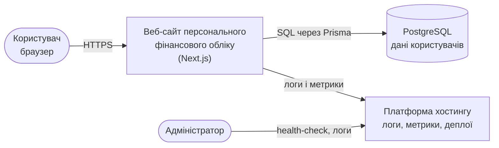
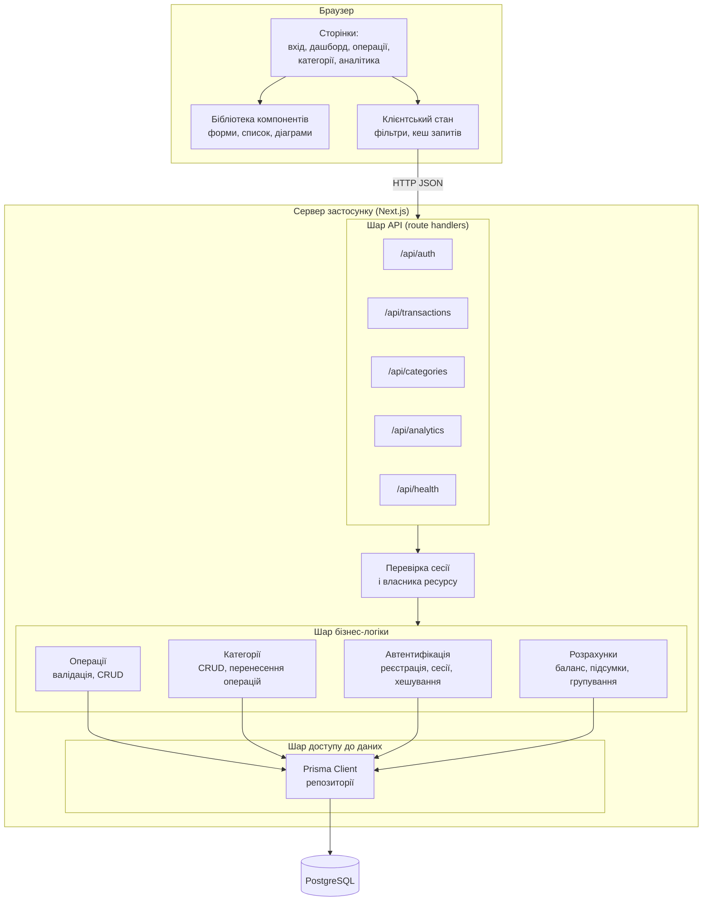
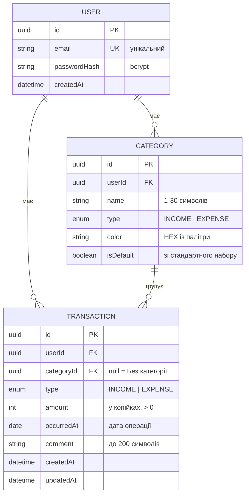
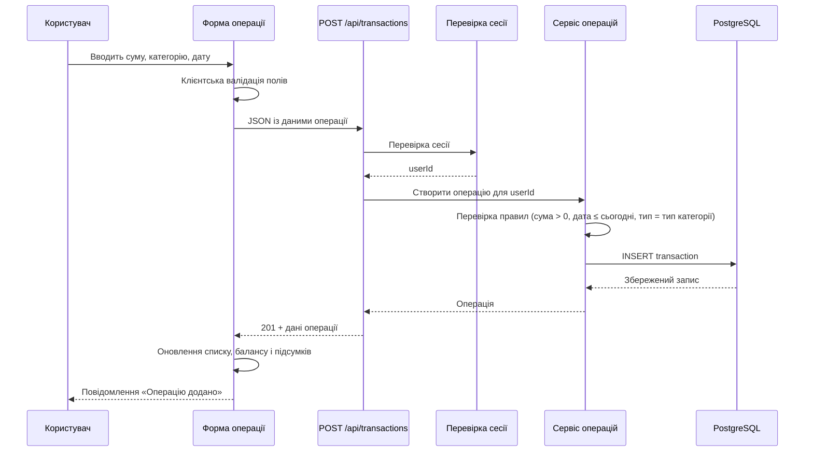
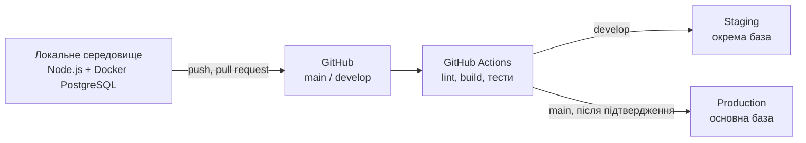

# Опис архітектури системи

**Проєкт:** Веб-сайт для персонального фінансового обліку
**Версія документа:** 1.0
**Дата:** 03.10.2026

---

## 1. Архітектурні рішення та їх обґрунтування

| Рішення                                                          | Обґрунтування                                                                                                  | Розглянуті альтернативи                                                 |
| ---------------------------------------------------------------- | -------------------------------------------------------------------------------------------------------------- | ----------------------------------------------------------------------- |
| Монолітний застосунок на Next.js (клієнт + API в одному проєкті) | Один розробник, один місяць, один деплой; спільні типи даних між клієнтом і сервером                           | Окремі SPA + Express API — зайва складність для цього обсягу            |
| Реляційна база PostgreSQL                                        | Дані чітко структуровані (користувач → категорія → операція), потрібні агрегації сум і групування за періодами | MongoDB — слабші агрегації і контроль цілісності зв'язків               |
| Prisma ORM                                                       | Типізований доступ до даних, параметризовані запити, керовані міграції                                         | Чистий SQL — більше ручної роботи і ризик помилок у запитах             |
| Рендеринг на сервері для сторінок зі списками                    | Перший екран віддається вже з даними, що допомагає виконати вимогу 2 секунд (NFR-1)                            | Повністю клієнтський рендеринг — довший час до першого корисного показу |
| Сесії в HTTP-only cookie                                         | Токен недоступний із JavaScript, менший ризик крадіжки через XSS (NFR-7)                                       | JWT у localStorage — доступний скриптам на сторінці                     |

---

## 2. Контекст системи



Система не має зовнішніх інтеграцій: усі дані вносить користувач, а єдиним сховищем є власна база даних.

---

## 3. Компонентна архітектура



### 3.1. Відповідальність шарів

| Шар                   | Відповідальність                                                                                          | Чого не робить                                                       |
| --------------------- | --------------------------------------------------------------------------------------------------------- | -------------------------------------------------------------------- |
| Сторінки і компоненти | Відображення даних, введення, навігація, клієнтська валідація форм                                        | Не звертається до бази напряму, не містить правил обчислення балансу |
| API (route handlers)  | Приймання запитів, перевірка сесії, розбір і перевірка вхідних даних, коди відповідей                     | Не містить бізнес-логіки обчислень                                   |
| Бізнес-логіка         | Правила: валідація операцій, перенесення операцій при видаленні категорії, розрахунок балансу і підсумків | Не знає про HTTP і про структуру відповіді                           |
| Доступ до даних       | Запити до БД, міграції, транзакції                                                                        | Не приймає рішень за бізнес-правилами                                |

Таке розділення потрібне насамперед для тестування: шар розрахунків покривається модульними тестами без бази й без HTTP (NFR-18), шар API — інтеграційними тестами.

---

## 4. Модель даних



**Обмеження цілісності та індекси:**

| Об'єкт                                  | Правило                                                                    |
| --------------------------------------- | -------------------------------------------------------------------------- |
| `USER.email`                            | Унікальний індекс, зберігається в нижньому регістрі                        |
| `CATEGORY (userId, type, name)`         | Унікальний складений індекс — назва неповторна в межах типу та користувача |
| `TRANSACTION.amount`                    | Перевірка `amount > 0`; знак визначається полем `type`, а не самим числом  |
| `TRANSACTION (userId, occurredAt)`      | Індекс для вибірки за періодом і сортування у списку                       |
| `TRANSACTION.categoryId`                | При видаленні категорії встановлюється `NULL` (`ON DELETE SET NULL`)       |
| `CATEGORY.userId`, `TRANSACTION.userId` | При видаленні користувача записи видаляються каскадом (FR-6)               |

---

## 5. API

Усі ендпоінти, крім реєстрації, входу й health-check, вимагають активної сесії та повертають лише дані поточного користувача.

| Метод і шлях                     | Призначення                 | Основні параметри                             | Коди відповіді     |
| -------------------------------- | --------------------------- | --------------------------------------------- | ------------------ |
| `POST /api/auth/register`        | Реєстрація                  | email, password                               | 201, 400, 409      |
| `POST /api/auth/login`           | Вхід                        | email, password                               | 200, 401, 429      |
| `POST /api/auth/logout`          | Вихід                       | —                                             | 204                |
| `GET /api/transactions`          | Список операцій             | from, to, type, categoryId, cursor, limit     | 200, 401           |
| `POST /api/transactions`         | Створення операції          | type, amount, categoryId, occurredAt, comment | 201, 400, 401      |
| `PATCH /api/transactions/:id`    | Редагування                 | будь-які поля операції                        | 200, 400, 403, 404 |
| `DELETE /api/transactions/:id`   | Видалення                   | —                                             | 204, 403, 404      |
| `GET /api/categories`            | Список категорій            | type                                          | 200, 401           |
| `POST /api/categories`           | Створення категорії         | name, type, color                             | 201, 400, 409      |
| `PATCH /api/categories/:id`      | Зміна категорії             | name, color                                   | 200, 400, 403, 409 |
| `DELETE /api/categories/:id`     | Видалення категорії         | —                                             | 204, 403, 404      |
| `GET /api/analytics/summary`     | Баланс і підсумки за період | from, to                                      | 200, 401           |
| `GET /api/analytics/by-category` | Витрати за категоріями      | from, to                                      | 200, 401           |
| `GET /api/analytics/timeline`    | Динаміка по місяцях         | from, to                                      | 200, 401           |
| `GET /api/health`                | Стан застосунку і БД        | —                                             | 200, 503           |

**Формат помилки:**

```json
{
	"error": {
		"code": "VALIDATION_ERROR",
		"message": "Сума має бути більшою за 0",
		"field": "amount"
	}
}
```

---

## 6. Потік даних: додавання операції



При помилці валідації сервіс повертає код `VALIDATION_ERROR` із назвою поля, форма підсвічує це поле, запит до бази не виконується.

---

## 7. Структура проєкту

```
finance-tracker/
├── app/                      # сторінки і маршрути Next.js
│   ├── (auth)/               # вхід, реєстрація
│   ├── dashboard/            # головна сторінка з балансом
│   ├── transactions/         # список і фільтри
│   ├── categories/           # керування категоріями
│   ├── analytics/            # діаграми
│   └── api/                  # ендпоінти
├── components/               # компоненти інтерфейсу
├── lib/
│   ├── services/             # бізнес-логіка (операції, категорії, розрахунки)
│   ├── validation/           # схеми перевірки вхідних даних
│   ├── auth/                 # сесії, хешування
│   └── format/               # форматування сум і дат
├── prisma/
│   ├── schema.prisma         # модель даних
│   ├── migrations/           # міграції
│   └── seed.ts               # базові категорії
├── tests/                    # unit, integration, api, e2e
├── docs/                     # документація проєкту
└── .github/workflows/        # CI та CD
```

---

## 8. Розгортання



Детальний опис середовищ, залежностей і стратегії розгортання готується на етапі M6 у файлі `docs/deployment-plan.md`.

---

## 9. Безпека

| Загроза                  | Захід                                                                                                                |
| ------------------------ | -------------------------------------------------------------------------------------------------------------------- |
| Крадіжка пароля з бази   | Зберігається лише хеш bcrypt із сіллю (NFR-4)                                                                        |
| Перехоплення трафіку     | HTTPS із перенаправленням з HTTP (NFR-5)                                                                             |
| Доступ до чужих даних    | Кожен запит до API фільтрує записи за `userId` із сесії; перевірка виконується на сервері, а не в інтерфейсі (NFR-6) |
| Крадіжка сесії через XSS | HTTP-only cookie, екранування користувацького тексту (NFR-7, NFR-9)                                                  |
| SQL-ін'єкції             | Параметризовані запити Prisma (NFR-9)                                                                                |
| Перебір пароля           | Обмеження кількості спроб входу (NFR-8)                                                                              |
| Витік секретів           | Змінні середовища і ключі зберігаються в налаштуваннях хостингу та GitHub Secrets, не потрапляють у репозиторій      |

---

## 10. Відповідність архітектури нефункціональним вимогам

| Вимога                   | Архітектурне рішення                                                                                                                    |
| ------------------------ | --------------------------------------------------------------------------------------------------------------------------------------- |
| NFR-1, NFR-2 (швидкість) | Рендеринг списків на сервері, індекс `(userId, occurredAt)`, агрегації сум на стороні бази, підвантаження списку порціями по 20 записів |
| NFR-3 (обсяг даних)      | Пагінація за курсором замість зсуву, агрегації в SQL замість обчислень у браузері                                                       |
| NFR-6, NFR-9 (безпека)   | Єдина точка перевірки сесії перед шаром бізнес-логіки                                                                                   |
| NFR-18 (якість коду)     | Відокремлений шар розрахунків без залежностей від HTTP і бази — покривається модульними тестами                                         |
| NFR-21 (точність)        | Цілі числа в копійках у базі, форматування лише на рівні відображення                                                                   |
| NFR-14 (адаптивність)    | Спільна бібліотека компонентів із єдиними контрольними точками, описана в `docs/ui/design-spec.md`                                      |
