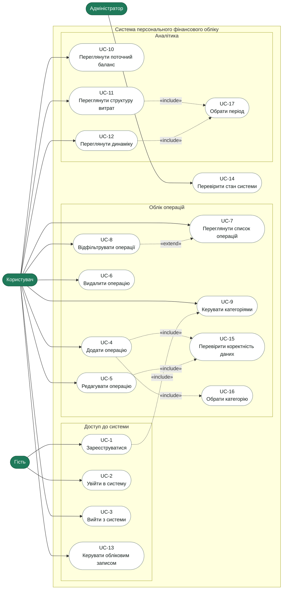

# Діаграма варіантів використання (Use Case Diagram)

**Проєкт:** Веб-сайт для персонального фінансового обліку
**Версія документа:** 1.0

---

## 1. Актори

| Актор         | Опис                                                                                                                   |
| ------------- | ---------------------------------------------------------------------------------------------------------------------- |
| Гість         | Відвідувач без активної сесії. Може зареєструватися або увійти                                                         |
| Користувач    | Зареєстрована особа. Успадковує можливості Гостя після входу і працює з власними операціями, категоріями та аналітикою |
| Адміністратор | Особа, яка підтримує працездатність системи: перевіряє стан застосунку і бази даних                                    |

---

## 2. Діаграма

**Пояснення зв'язків:**

- `«include»` — варіант використання завжди містить інший як обов'язкову частину. Наприклад, додавання операції завжди включає перевірку коректності даних і вибір категорії; реєстрація включає створення базового набору категорій.
- `«extend»` — варіант використання за потреби розширює базовий. Фільтрація розширює перегляд списку: список можна переглядати й без фільтрів.

---

## 3. Описи основних сценаріїв

### UC-1. Зареєструватися

| Поле       | Значення                                                              |
| ---------- | --------------------------------------------------------------------- |
| Актор      | Гість                                                                 |
| Передумова | Користувач не має облікового запису                                   |
| Результат  | Створено обліковий запис із базовим набором категорій, відкрито сесію |
| Вимоги     | FR-1, FR-7                                                            |

**Основний сценарій:**

1. Гість відкриває сторінку реєстрації.
2. Вводить email і пароль, підтверджує пароль.
3. Система перевіряє формат email, довжину пароля та унікальність email.
4. Система створює обліковий запис, зберігає хеш пароля, створює базові категорії.
5. Система відкриває сесію і перенаправляє на головну сторінку.

**Альтернативи:**

- 3a. Email уже зареєстрований → система показує помилку, обліковий запис не створюється.
- 3b. Пароль коротший за 8 символів → система підсвічує поле з поясненням.

### UC-2. Увійти в систему

| Поле       | Значення                                             |
| ---------- | ---------------------------------------------------- |
| Актор      | Гість                                                |
| Передумова | Обліковий запис існує                                |
| Результат  | Відкрито сесію, показано головну сторінку з балансом |
| Вимоги     | FR-2, NFR-8                                          |

**Основний сценарій:**

1. Гість відкриває сторінку входу і вводить email та пароль.
2. Система знаходить обліковий запис і порівнює хеш пароля.
3. Система відкриває сесію і перенаправляє на головну сторінку.

**Альтернативи:**

- 2a. Дані не збігаються → повідомлення «Неправильний email або пароль».
- 2b. Перевищено ліміт невдалих спроб → вхід тимчасово заблоковано.

### UC-4. Додати операцію

| Поле       | Значення                                           |
| ---------- | -------------------------------------------------- |
| Актор      | Користувач                                         |
| Передумова | Користувач увійшов у систему                       |
| Результат  | Операцію збережено, баланс і підсумки перераховано |
| Вимоги     | FR-11, FR-12, FR-18                                |

**Основний сценарій:**

1. Користувач натискає «Додати операцію».
2. Система відкриває форму з типом «Витрата» і сьогоднішньою датою.
3. Користувач вводить суму, обирає категорію, за потреби змінює тип, дату і додає коментар.
4. Система перевіряє дані (UC-15).
5. Система зберігає операцію, закриває форму, оновлює список, баланс і підсумки.

**Альтернативи:**

- 4a. Сума не більша за 0 або дата в майбутньому → помилка біля відповідного поля, операція не зберігається.
- 3a. Потрібної категорії немає → користувач переходить до керування категоріями (UC-9) і повертається до форми.

### UC-8. Відфільтрувати операції

| Поле       | Значення                                                 |
| ---------- | -------------------------------------------------------- |
| Актор      | Користувач                                               |
| Передумова | Користувач переглядає список операцій                    |
| Результат  | Показано операції, що відповідають умовам, і їх підсумок |
| Вимоги     | FR-15, FR-16                                             |

**Основний сценарій:**

1. Користувач обирає період, тип операції та категорію.
2. Система формує запит із урахуванням усіх обраних умов.
3. Система показує відфільтрований список, підсумок за ним і зберігає умови в адресі сторінки.

**Альтернативи:**

- 3a. Операцій за умовами немає → повідомлення «За цими умовами операцій немає» і кнопка скидання фільтрів.

### UC-11. Переглянути структуру витрат

| Поле       | Значення                                        |
| ---------- | ----------------------------------------------- |
| Актор      | Користувач                                      |
| Передумова | Користувач увійшов у систему                    |
| Результат  | Показано кругову діаграму витрат за категоріями |
| Вимоги     | FR-20, FR-22                                    |

**Основний сценарій:**

1. Користувач відкриває сторінку аналітики.
2. Обирає період (UC-17).
3. Система групує витрати за категоріями, обчислює суми та частки.
4. Система будує кругову діаграму з підписами сум і відсотків; категорії з часткою менше 3 % об'єднує в «Інше».

**Альтернативи:**

- 3a. За період немає витрат → показано порожній стан із кнопкою додавання операції.

### UC-14. Перевірити стан системи

| Поле       | Значення                                                        |
| ---------- | --------------------------------------------------------------- |
| Актор      | Адміністратор                                                   |
| Передумова | Застосунок розгорнуто                                           |
| Результат  | Отримано відповідь про стан застосунку і доступність бази даних |
| Вимоги     | FR-23, NFR-17                                                   |

**Основний сценарій:**

1. Адміністратор звертається до службового ендпоінта стану.
2. Система перевіряє з'єднання з базою даних.
3. Система повертає статус, версію застосунку і час відповіді бази.

**Альтернативи:**

- 2a. База недоступна → повертається код помилки, подія потрапляє в лог і в сповіщення.

---

## 4. Повний перелік варіантів використання

| ID    | Варіант використання         | Актор         | Пріоритет |
| ----- | ---------------------------- | ------------- | --------- |
| UC-1  | Зареєструватися              | Гість         | M         |
| UC-2  | Увійти в систему             | Гість         | M         |
| UC-3  | Вийти з системи              | Користувач    | M         |
| UC-4  | Додати операцію              | Користувач    | M         |
| UC-5  | Редагувати операцію          | Користувач    | M         |
| UC-6  | Видалити операцію            | Користувач    | M         |
| UC-7  | Переглянути список операцій  | Користувач    | M         |
| UC-8  | Відфільтрувати операції      | Користувач    | M         |
| UC-9  | Керувати категоріями         | Користувач    | M         |
| UC-10 | Переглянути поточний баланс  | Користувач    | M         |
| UC-11 | Переглянути структуру витрат | Користувач    | M         |
| UC-12 | Переглянути динаміку         | Користувач    | M         |
| UC-13 | Керувати обліковим записом   | Користувач    | S         |
| UC-14 | Перевірити стан системи      | Адміністратор | S         |
| UC-15 | Перевірити коректність даних | — (include)   | M         |
| UC-16 | Обрати категорію             | — (include)   | M         |
| UC-17 | Обрати період                | — (include)   | M         |
